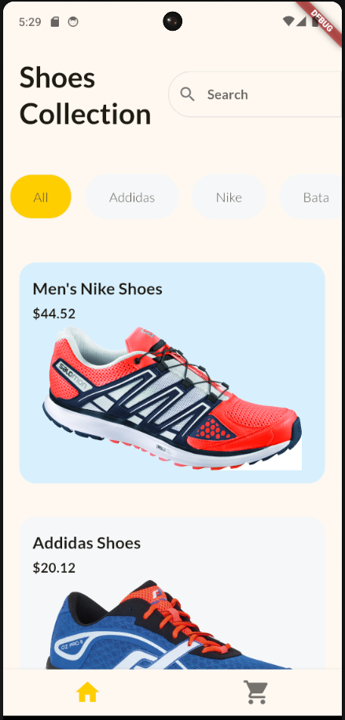

# Shopping App

A Flutter-based Shopping App that showcases a collection of shoes. Users can browse different shoes on the home page, view detailed information including images, price, and available sizes on the detail page, select a size, and add shoes to their cart. The app also allows users to manage their cart by adding or removing selected items.

## Features

- Browse shoes on the home page.
- View detailed information about each shoe.
- Select size and add shoes to the cart.
- Manage cart items (add or remove items).

## Screenshots

### Home Page


### Shoe Detail Page


### Cart Page


## Getting Started

### Prerequisites

- Flutter SDK
- A code editor (VS Code, Android Studio, etc.)

### Installation

1. Clone the repository:
   ```sh
   git clone https://github.com/your-username/ShoppingApp.git
   cd ShoppingApp

2. Install dependencies:

- flutter pub get
  
3. Run the app:
   
- flutter run

## Usage
1. Ensure you have Flutter installed and set up on your machine.
2. Open the project in your preferred code editor.
3. Use the flutter run command to run the app on an emulator or a physical device.

